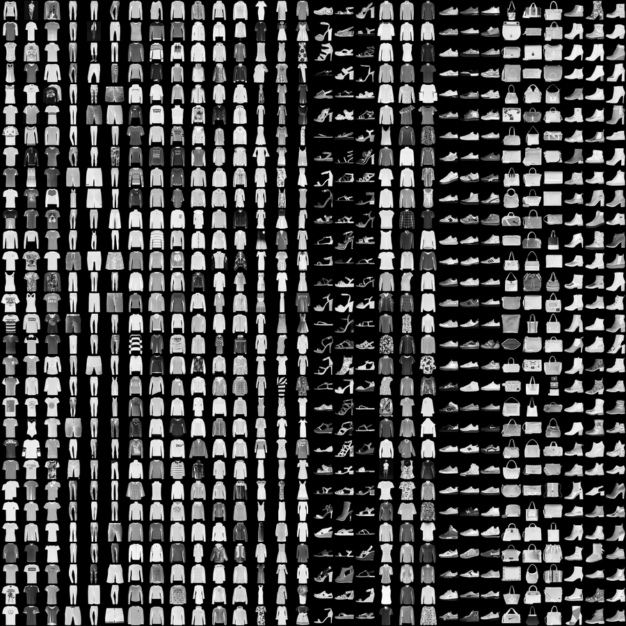
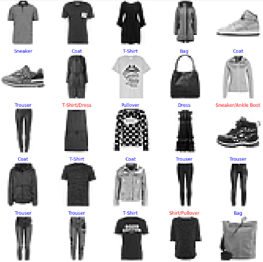

# Fashion-MNIST-Classification 

Here's an example where my model fails to classify item right. But, I can see thats the reason because there is not a big difference between these items. 

## Requirements
- TensorFlow 2.x
- TensorFlow-Datasets
